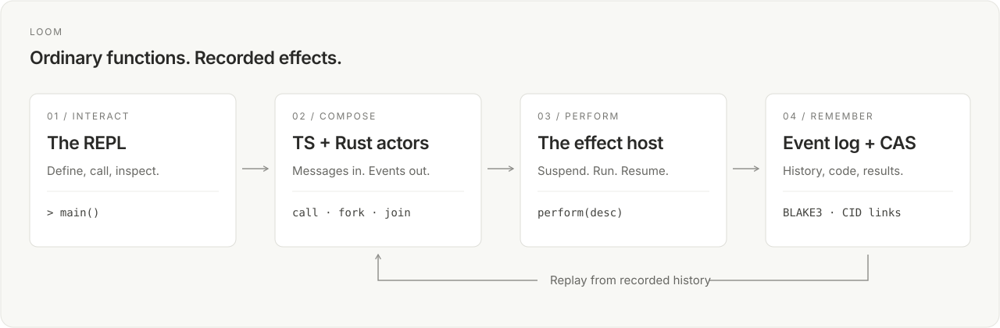
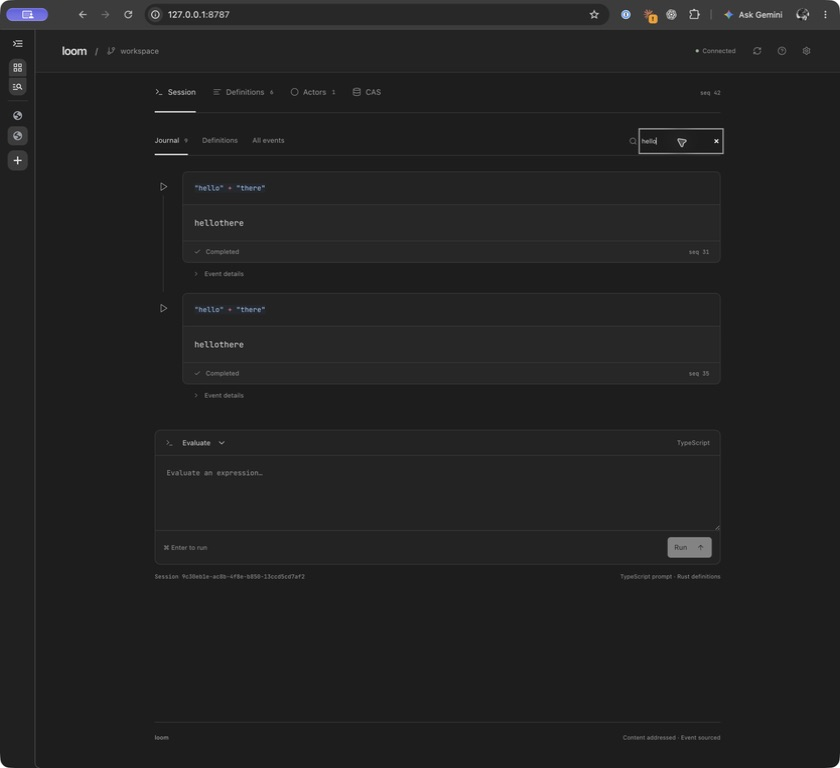
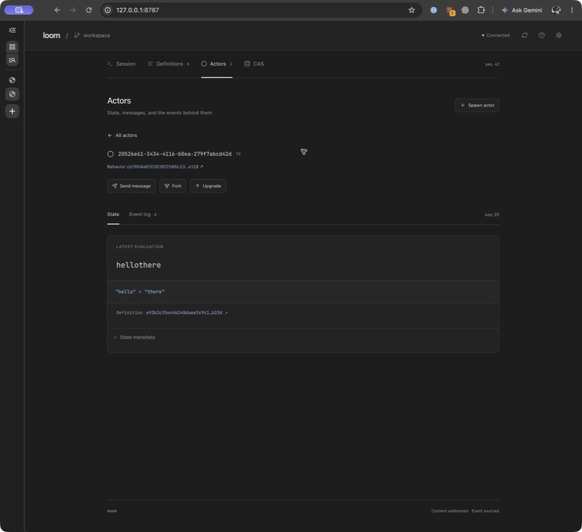
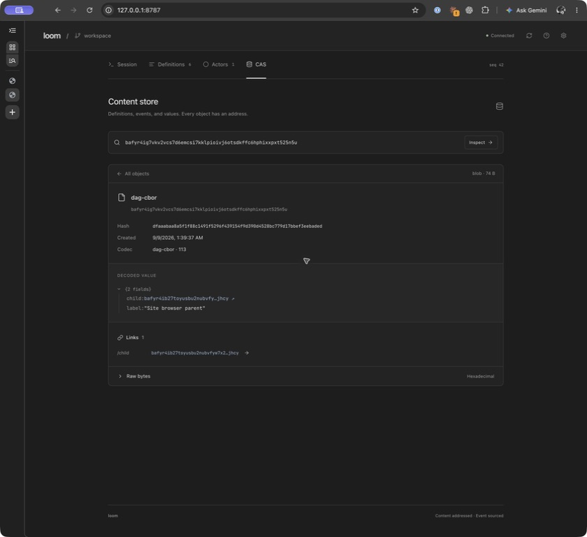

# Loom

**A persistent REPL for actors. Algebraic effects without function coloring.**

Write TypeScript or Rust. Call abilities like ordinary functions. Loom handles suspension, concurrency, and recorded effects underneath.



```ts
import { all, sleep } from "loom";

export function main(): string {
  all([sleep.desc(100), sleep.desc(200)]);
  return "both finished";
}
```

The same example in Rust:

```rust
use loom::abilities::sleep;

#[loom::def]
pub fn main() -> String {
    loom::all([sleep::desc(100), sleep::desc(200)]).expect("sleep failed");
    "both finished".into()
}
```

Two effects run concurrently. Both examples use ordinary synchronous functions; the host handles suspension and resumption.

- **One REPL, two languages.** Define interactively, call across languages, `fork` work by hash, and `join` the results.
- **Actors with history.** State is folded from events. Fork a session, replay an actor, or upgrade its behavior.
- **Effects you can inspect.** The host records results and reuses them during replay. Descriptors make fan-out and caching explicit.
- **Content you can follow.** Code and outputs live in a BLAKE3 CAS; DAG-CBOR gives structured values real CID links.

<details>
<summary>See the REPL, actors, and CAS</summary>





</details>

### Try it

```sh
nix run .
```

Open **http://localhost:8787** for the Svelte app; the launcher prints the token file location. Nix supplies both guest toolchains. The same runtime is available through the terminal REPL, HTTP, and MCP.

[Setup, API, and architecture →](docs/guide.md)

Connect Codex with `bun scripts/configure-codex-mcp.ts --token-file /path/to/loom/token`.
See the [MCP setup and verification guide](docs/guide.md#codex-over-mcp).
