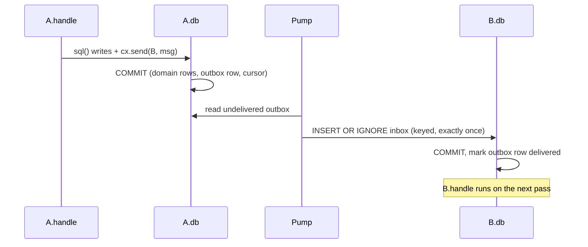
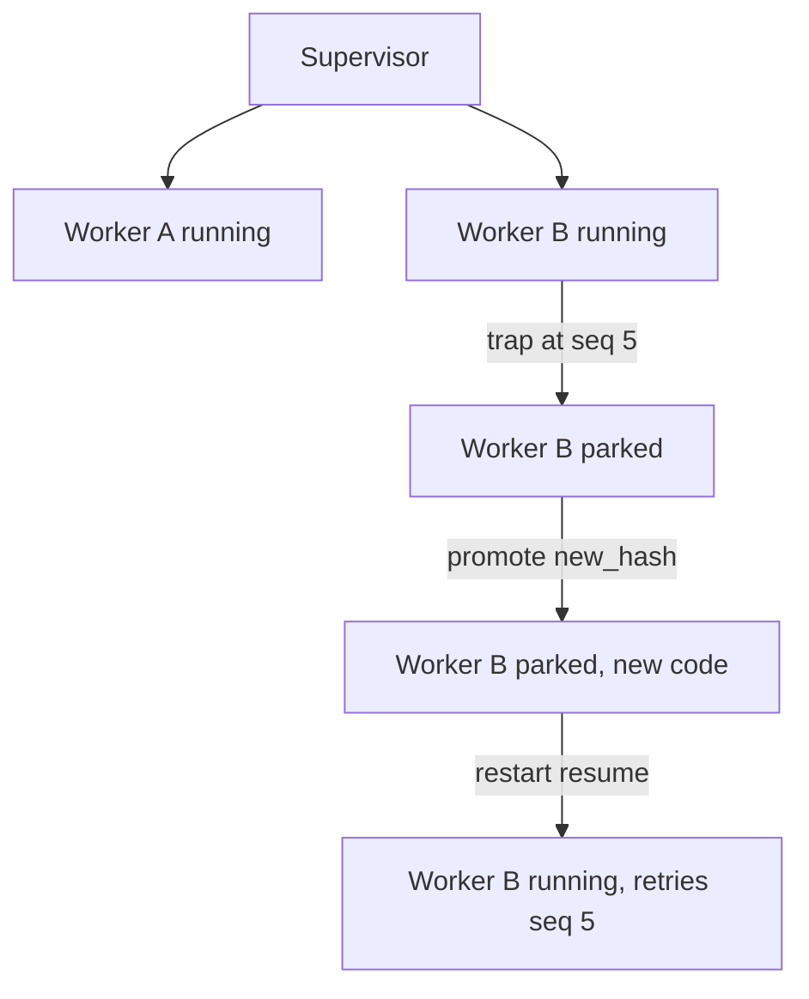

# Loom

Loom is a Rust execution runtime. Ordinary Rust functions perform algebraic effects
(`loom::sleep`, filesystem reads, model calls) on WebAssembly fibers: a call suspends
the fiber, a host handler does the work, the fiber resumes with the result, and
signatures stay ordinary Rust throughout. Actors (`loom-actor`) add durable,
supervised state: one Turso (SQLite-in-Rust) file per actor, one message per
transaction, OTP-parity supervision trees.

## Try it

```sh
nix run .                 # starts loomd, prints the token file path
nix run . -- --stdio      # same daemon, MCP over stdio for a coding agent
cargo test -p loom-actor  # 22 tests: the actor engine, standalone
```

Open `http://127.0.0.1:8787` and paste the printed token for the browser REPL.
See [docs/guide.md](docs/guide.md) for running without Nix and for the HTTP API.

## Effects

Effect rows are inferred from resolved calls, including concrete trait and generic calls. A runtime-selected `perform` label is rejected with its call site; use a literal or Rust constant label.

Calling an effect performs it. A handler can supply a value, forward to an outer
handler, or keep a one-shot continuation to resume later:

```rust
use loom::sleep;

pub fn main() {
    loom::scope(|s| {
        let a = s.spawn(|| sleep(100)).expect("spawn");
        let b = s.spawn(|| sleep(200)).expect("spawn");
        a.join().expect("sleep");
        b.join().expect("sleep");
    });
}
```

The two scoped children run concurrently, so their sleeps overlap; `scope` waits for
both before returning. The guest-handler round trip (install, dispatch, resume,
remove) measured **13.811 µs median, 24.356 µs p99** over 10,000 warm calls on Linux,
September 10, 2026. Reproduce with `bun scripts/bench/effects-handlers.ts`. See
[docs/guide.md](docs/guide.md) for handler installation and
[content-addressed handlers](docs/content-addressed-handlers.md).

## Actors

An actor is one file: a mailbox (`inbox`), a behavior (content-hashed, in
`code_changes`), and domain tables the behavior owns. Handling one inbox message
runs inside one transaction that commits domain writes, effect records, and outbox
rows together; nothing is delivered until that transaction commits.



A handler error (or panic) is a `Trap`: the message rolls back, a `dead_letters` row
is written, and the actor parks. A supervisor restarts it by `resume` (retry the same
message, after a code change), `skip`, or `reset` (fresh file, same id):



Actor behaviors are stored Rust definitions. Add one, then spawn it by its returned
hash or name on the running node. Every crate-root `pub fn` is an entry; effect
rows are inferred by the driver.

```rust
pub const LOOM_SCHEMA: &str = "CREATE TABLE arrivals(value INTEGER)";
pub fn handle(_message: Vec<u8>) {
    let args: loom::serde_json::Value = loom::serde_json::from_str(
        "{\"sql\":\"INSERT INTO arrivals VALUES (42)\",\"params\":[]}"
    ).unwrap();
    let _: loom::serde_json::Value = loom::perform("sql", args).unwrap();
}
```

Strategies (`one_for_one`, `one_for_all`, `rest_for_one`, `dynamic`), links, monitors,
forking a live actor at a past `seq` for validation, and `node.promote_where` for a
hot-load sweep across every actor on a hash are in
[docs/actors-turso.md](docs/actors-turso.md).

## Hook in over MCP

`loomd` also serves actors as MCP tools, so a coding agent can inspect and drive the
supervision tree directly. CLI, HTTP, and MCP use the same verb and argument names
and return `{ok, seq, result, diagnostics}`, including failures. Omitted spawn
`init` defaults to `null`; promotions require `author` and `rationale`:


| tool | does |
| --- | --- |
| `add(source, name?)` / `update(name, source)` | publish a definition and its inferred entry rows |
| `view(target)` / `history(name)` | stored source and definition history |
| `diff(old, new)` / `dependents(hash)` | item differences and pinned callers |
| `run(target, args?)` / `find(text)` | execute or search definitions |
| `actors()` | every actor: id, status, behavior hash, cursor, inbox length, parent |
| `tree(root?)` | nested tree from a root (default the node's root supervisor) |
| `info(id)` | status, reason, cursor, deferred/inbox length, links, monitors, children |
| `send(id, key?, msg)` | inject a keyed message; return cursor or a failed envelope with id, sequence, and trap cause |
| `spawn(def, init?, parent?, spec?)` | spawn under a parent, return its id |
| `stop(id, reason)` | stop with a reason |
| `restart(id, verb)` | `resume` \| `skip` \| `reset` |
| `promote(id, hash, author, rationale)` | append a `code_changes` row |
| `promote_where(old, new, author, rationale)` | promote every actor on `old_hash` |
| `lineage(id)` | the actor's `code_changes` rows |
| `dead_letters(id)` | its trapped messages |
| `fork(id, seq)` | copy the actor's state as of `seq` into a new, undeliverable fork |
| `validate(id, candidate, k, assertions?)` | replay the last `k` messages under `candidate_hash` on a fork, report `Matched`/`DivergedAt`/`Differs`/`Trapped` |
| `sql(id, query, params?)` | read-only inspection; a write statement is refused |
| `whereis` / `register` / `members` | name and group lookup |
| `behaviors()` | stored definition hashes, one line each |
| `drain()` | run every actor to idle, return messages processed |

Resources: `actor://<id>/inbox`, `.../effects`, `.../outbox`, `.../lineage`, and
`actor://tree`.

```sh
bun scripts/configure-codex-mcp.ts --token-file /path/to/loom/token
```

## Content-addressed code

Loom can identify Rust definitions by resolved HIR content with `tools/hash-rustc`.
The driver uses the pinned `nightly-2026-08-24` compiler and its normal pipeline.
Set `LOOM_ITEM_HASHES` and `LOOM_ITEM_PREIMAGES` for JSON identities and checkable bytes.
Formatting, local renaming, and item reordering leave ordinary entry hashes unchanged.
Changing a reachable helper changes the entry; changing an unrelated helper does not.
Mutually recursive items share one cycle hash and receive indexed member hashes.
Inherent method calls resolve to one method; trait calls retain the trait method identity.
Generic bodies hash once, and monomorphized implementations are outside that identity.
Wasm and toolchain digests must separately identify each executable realization.
The loom-build and storage seam is documented in docs/content-addressed-code.md and is not yet connected.

Details: [docs/content-addressed-code.md](docs/content-addressed-code.md).
## Layout

| crate | is |
| --- | --- |
| `loom-actor` | one Turso file per actor, the pump, supervision |
| `loom-api` | HTTP/WebSocket service: auth, CAS browsing, the REPL API |
| `loom-build` | core wasm builder |
| `loom-check` | effect/language checking before a definition becomes executable |
| `loom-cli` | command-line client for a running `loomd` |
| `loom-guest-rs` | synchronous guest interface to the host, for Rust definitions |
| `loom-maintenance` | garbage collection over derived indexes only; CAS and event log untouched |
| `loom-mcp` | MCP server exposing the API as tools |
| `loom-model` | OpenAI-compatible model provider boundary |
| `loom-process` | durable process lifecycle for sandboxed machine commands |
| `loom-proto` | shared protocol types |
| `loom-rt` | the effect host runtime: filesystem, machine execution, shared core |
| `loom-store` | SQLite-backed event log and content-addressed store |
| `loomd` | the daemon binary: UI, API, and MCP endpoints |

Top level: `crates/` (above), `docs/`, `examples/`, `scripts/`, `deploy/`, `nix/`,
`ui/` (Svelte browser REPL), `rustc/` (Rust
guest toolchain build).

## Docs

[docs/guide.md](docs/guide.md) covers the HTTP API, non-Nix setup, and isolation
model. [docs/actors-turso.md](docs/actors-turso.md) is the actor spec in full,
including OTP parity. [docs/content-addressed-handlers.md](docs/content-addressed-handlers.md)
covers stored handler definitions. [scripts/bench/README.md](scripts/bench/README.md#reproduce)
reproduces the largest-file-scan benchmark described there.
