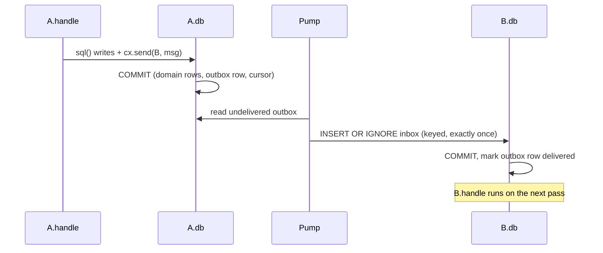
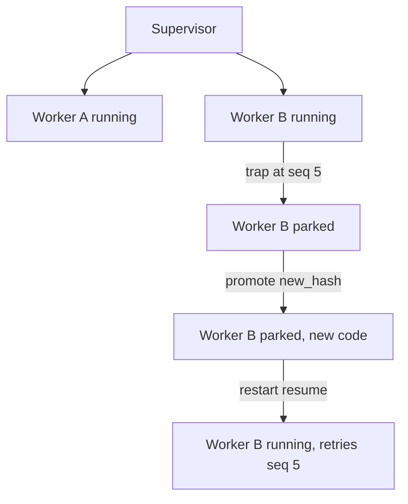

# Loom

Loom executes Rust on WebAssembly and JavaScript in V8 isolates. Ordinary Rust functions perform algebraic effects
(`loom::sleep`, filesystem reads, model calls) on WebAssembly fibers: a call suspends
the fiber, a host handler does the work, the fiber resumes with the result, and
signatures stay ordinary Rust throughout. Actors (`loom-actor`) add durable,
supervised state: one Turso (SQLite-in-Rust) file per actor, one message per
transaction, OTP-parity supervision trees.

## Try it

```sh
nix run --builders '' .#repl -- --bind 127.0.0.1:8793
```

The launcher prints `Token file: <path>` and opens `http://127.0.0.1:8793/#token=<token>`. It also prints `CLI: <store path>/bin/loom`. In another terminal, use that CLI and token:

```sh
export LOOM_TOKEN="$(cat /path/printed/by/launcher)"
export LOOM_URL=http://127.0.0.1:8793
export PATH="/store/path/printed/by/launcher/bin:$PATH"
loom --url "$LOOM_URL" add examples/unison/greet.rs --lang rust --name greet
# Copy the returned definition hash into OLD.
OLD='paste-definition-hash'
loom --url "$LOOM_URL" view "$OLD"                       # stored source and two items
loom --url "$LOOM_URL" run greet '"loom"'                 # "hello, loom"; effects []
loom --url "$LOOM_URL" update greet examples/unison/greet-v2.rs  # same hash: local renamed
loom --url "$LOOM_URL" update greet examples/unison/greet-v3.rs  # new hash: constant changed
loom --url "$LOOM_URL" run "$OLD" '"loom"'                # still "hello, loom"
loom --url "$LOOM_URL" history greet                     # both hashes
loom --url "$LOOM_URL" add examples/unison/shout.rs --lang rust --name shout --dep greet=greet  # use greet::greet
loom --url "$LOOM_URL" export shout --out shout.car      # shout, greet, sources and identities in one file
loom --url "$LOOM_URL" import shout.car --into friend    # rebuilds friend/shout; same hashes or it refuses
loom --url "$LOOM_URL" add examples/unison/sleeper.rs --lang rust --name sleeper     # inferred effects ["sleep"]
loom --url "$LOOM_URL" add examples/unison/counter.rs --lang rust --name counter
loom --url "$LOOM_URL" spawn counter
ID='paste-actor-id'
loom --url "$LOOM_URL" send "$ID" 1
loom --url "$LOOM_URL" send "$ID" 1
loom --url "$LOOM_URL" send "$ID" 1
loom --url "$LOOM_URL" info "$ID"                        # cursor 3
loom --url "$LOOM_URL" add examples/unison/counter-v2.rs --lang rust --name counter-v2
V2='paste-counter-v2-definition-hash'
loom --url "$LOOM_URL" validate "$ID" "$V2" 3            # Differs, with table hashes
loom --url "$LOOM_URL" promote "$ID" "$V2" --rationale e2e --author e2e
loom --url "$LOOM_URL" lineage "$ID"                     # both behavior hashes
loom --url "$LOOM_URL" send "$ID" 1
loom --url "$LOOM_URL" info "$ID"                        # cursor 4
```

The guests use plain root-level `pub fn` entries, no macros or effect declarations. The counter declares its SQL schema with `pub const LOOM_SCHEMA: &str`; `add` infers effect rows, including the sleeper's generic trait call.

For the executable proof, stop the daemon on the test port, ensure `nix`, `bun`, and `curl` are on `PATH`, commit your changes, then run:

```sh
LOOM_E2E_PORT=8793 scripts/e2e-unison.sh
```

The script starts `nix run --builders '' .#repl -- --bind 127.0.0.1:8793` with a fresh state directory on this machine and takes the CLI from the launcher’s `CLI:` line. `LOOM_E2E_PORT` defaults to 8787; the command above uses 8793 to leave an existing REPL on 8787 alone. It checks the sequence above, moves its disposable source file before `view`, then repeats the workflow through authenticated HTTP MCP. Each check prints `ok <n> <name>` or `FAIL <n> <name>: <reason>`. MCP prints its own `N/9`; the final line is the overall `N/9`. A full pass is `9/9` with exit status zero. State and logs remain at the printed directory for inspection.

See [the guide's Try it section](docs/guide.md#try-it) for transport details and response shapes.

The package includes `nightly-2026-08-24` and the prebuilt content-hashing rustc driver. Guest compilation uses those tools through the launcher’s `RUSTC` and `LOOM_HASH_RUSTC` settings.

## TypeScript and JavaScript actors

This release changes the V8 execution ABI. Existing running JS or TypeScript
actors admitted under an older ABI can prevent daemon startup; see
[backend upgrade checks and limits](crates/loom-v8/README.md#backend-upgrades).
The native POC uses fresh databases.

TypeScript and JavaScript use the same durable actors, SQL transactions,
capabilities, and message delivery as Rust. TypeScript is the default language
for `add`. Save this as `counter.ts`:

```typescript
const LOOM_SCHEMA = "CREATE TABLE increments(amount INTEGER)";

const main = loom.messages.json(async (message: {amount: number} | null) => {
    if (message === null) return;
    await loom.sql("INSERT INTO increments VALUES (?)", [message.amount]);
});
```

```sh
loom add counter.ts --name counter
loom spawn counter
ID='paste-actor-id'
loom send "$ID" '{"amount":1}'
loom info "$ID"
```

`loom.messages.json` decodes each message as UTF-8 JSON. A plain `main` receives
an array of bytes. Each invocation starts with fresh JavaScript state; keep
durable state in SQL. `LOOM_SCHEMA` runs when an actor is created or promoted.
Ordinary functions can also use `loom run`; its JSON array supplies positional
arguments to `main(...args)`.

Use `const main = loom.actor({onStart, onMessage, onStop})` when an actor needs
lifecycle hooks. `onMessage` receives decoded JSON and is required; the other
hooks are optional. The host calls `onStart` after schema setup on activation,
before ordinary messages, and `onStop("node_shutdown")` during graceful node
shutdown. An abrupt host exit cannot run `onStop`. To resume a container-backed
workflow, persist its desired configuration in SQL and create a fresh container
in `onStart`; container process memory is not restored. See
[actor lifecycle](crates/loom-v8/README.md#actor-lifecycle).

Loom transpiles source-only TypeScript with `deno_ast` and bundles modules
with pinned Deno tooling at admission; neither path performs semantic type
checking. The runtime provides the Loom APIs below. It does not install
Deno globals or operating-system access. Use `--lang javascript` for JavaScript
source and `--lang rust` for Rust.

Static imports support `npm:`, `jsr:`, and approved HTTPS origins. Admission
stores the bundle, dependency lock, and dependency sources; runtime reopen
uses that stored artifact offline. Define `main` locally or export it by name.
Dynamic imports and default-only exports are unsupported. See
[module admission](crates/loom-v8/README.md#module-admission) for the host policy.

Pass capabilities in messages to connect actors. Inside a JSON handler:

```javascript
const peer = await loom.actors.accept(message.peer);
await peer.send({type: "hello"});
```

`accept` verifies and saves the capability. Actor references encode messages
as UTF-8 JSON and expose `send`, `call`, `reply`, timers, and `stop`.
`loom.actors.spawn(spec)` returns a child reference; serializing a reference
passes its capability token. Knowing an actor ID alone does not grant access.
Calls return a request reference; replies arrive as later actor messages.

Use `await loom.actors.named("worker")` for a host-published actor in the
current tenant and `await loom.actors.sender()` for the current message's
sender. Names resolve within the tenant selected by the authenticated host;
guest code cannot select another tenant. `loom.actors.spawn` takes a behavior
hash and ordinary JSON initialization:

```javascript
const child = await loom.actors.spawn({behavior: message.behaviorHash, init: {count: 0}});
await child.send({type: "increment", amount: 1});
```

Host-configured processes use the same capability and message system.
`await loom.processes.named("claude")` accesses the registered process actor;
`await loom.processes.spawn("claude", {subscriber: await loom.actors.self()})`
starts a new instance of that preset and subscribes before it starts.
Process handles provide `write(text)`, `closeStdin()`, `cancel()`, and
`subscribe(actor)`. Output arrives in later messages. Processes do not
automatically restart after exit or host restart.

For a temporary container, select an image through the tenant's
host-configured Docker connection:

```javascript
const sandbox = await loom.containers.spawn({
    image: "alpine:3.22",
    command: "cat",
    network: "none",
    limits: {memoryMb: 128, cpus: 1, pids: 32},
    ttlMs: 60000,
    subscriber: await loom.actors.self(),
});
await sandbox.write("hello\n");
await sandbox.closeStdin();
```

Containers return the same process handles and output messages as process
presets. Persist and restore their capabilities with `loom.processes.get(cap)`.
See [temporary containers](crates/loom-v8/README.md#temporary-containers) for
host configuration and lifetime.

### CAS and Linux VMs

`loom.cas.put(bytes)` stores raw bytes and returns a serializable `{$ref: CID}`.
`loom.cas.get(ref)` reads them from the current tenant's store. Use
`putJson(value)` and `getJson(ref)` for JSON documents. Guest CAS operations
have a 128 KiB object limit; [the rootfs importer](tools/import-vm-image.py)
streams larger files into the tenant's CAS.

`loom.vms.spawn` boots a Linux rootfs manifest from CAS and returns the same
process handle as containers. Inside an actor handler receiving `message.image`:

```javascript
const vm = await loom.vms.spawn({
    image: message.image,
    command: "/bin/sh",
    args: ["-i"],
    env: {PATH: "/bin"},
    network: "none",
    limits: {memoryMb: 256, cpus: 1, rootfsMb: 64},
    ttlMs: 60000,
    subscriber: await loom.actors.self(),
});
await vm.write("uname -a\n");
```

The backend requires x86_64 Linux with KVM. VM networking currently supports
only `"none"`. Shutdown destroys the temporary VM and its writable rootfs;
an actor's next `onStart` can boot a fresh VM from its saved image reference.
SQL state resumes; VM memory snapshots are not restored. See the
[VM actor example](examples/vm-actor/main.ts),
[native smoke](tools/smoke-loomd-vm.py), and
[CAS and VM setup](crates/loom-v8/README.md#linux-vms).

### WebSockets and effects

`await loom.websockets.listen()` attaches a native WebSocket listener driver
to an actor. On `websocket.message`, use `await loom.websockets.sender()` to
get the connection handle, then `send(text)`, `sendBytes(bytes)`, or `close()`.
The native connection survives fresh V8 isolates between messages. Host
restart closes it; the actor must listen again and the client must reconnect.
See the [JavaScript API guide](crates/loom-v8/README.md#websockets) for an
authenticated browser example and [editor declarations](crates/loom-v8/api.d.ts).

`loom.sql(query, params)` accepts plain JavaScript values and returns an array
of row objects. The raw `loom.perform("sql", ...)` contract uses tagged SQL
cells. `loom.now` and `loom.random` use the recorded effect path.
`await loom.perform(op, args)` exposes the complete
[actor effect API](crates/loom-behavior/README.md#effect-wire-contract).
Actor SQL and messaging require an actor transaction; a standalone `run` uses
the runtime's host effects.

Use `--allowed_effects '["sql","actor.send"]'` to restrict a definition's
escaped effects. JavaScript effects are checked at execution because their
names can be computed dynamically. Loom definition dependencies are currently
rejected for TypeScript and JavaScript.

### Native container and lifecycle smoke

The standalone [container actor](examples/container-actor/main.ts) persists its
image configuration and recreates its container after daemon restart. The
[native smoke script](tools/smoke-loomd-v8.py) loads this same source, checks
stdin/stdout before and after restart, and requires different container IDs.

On Linux, use a prebuilt `loomd`, a static BusyBox executable, and a running
Docker daemon. The packaged daemon embeds the pinned import compiler wrapper
and bubblewrap paths. For an ad-hoc Cargo binary, set `LOOM_DENO` to the
[confined Deno compiler wrapper](nix/README.md#javascript-import-compiler) and
`LOOM_BWRAP` to an absolute bubblewrap executable, or put `bwrap` on the
supervisor's absolute `PATH`. The compiler needs network access during package
admission; the smoke then disables it to verify offline reopen.

Build the real Claude Code image with the
[pinned image builder](examples/claude-container/build.sh):

```sh
./examples/claude-container/build.sh
LOOM_STATIC_BUSYBOX=/absolute/path/to/busybox python3 tools/smoke-loomd-v8.py \
  /absolute/path/to/loomd \
  --npm \
  --docker-executable /absolute/path/to/docker \
  --docker-image busybox@sha256:9db7b59979c38555a39def84a31fb98b5296952f9e3afd4f6f11f05b07adfab0 \
  --claude-image loom-claude:2.1.272
```

Preload the BusyBox image into that Docker daemon. Set `DOCKER` and
`DOCKER_HOST` for the builder and add `--docker-host ENDPOINT` to the smoke
command when using a custom Docker connection. This native POC passed `9/9`;
the script reports `"passed": 9, "total": 9`. It covers durable SQL,
tenant-scoped actor messaging, process I/O, WebSockets, external package
admission and offline reopen, container stdin/cancellation/removal, actual
Claude Code startup, and graceful lifecycle restart with a fresh container
and no replayed stdin. The Claude check runs the actual binary's `--version`
without credentials or an inference request.

## Updating functions and callers

`update` rebuilds affected definitions in dependency order and publishes their names
in one transaction. Historical hashes remain executable. If a caller stops
typechecking, the response contains `update.status: "needs_repair"`, a durable
session ID and revision, and the affected sources with compiler diagnostics. Live
names retain their previous definitions until the entire update succeeds.

Agents should pass `expected_hash` from the source they edited and a unique
`request_id` that can recover the session after a timeout, then use
`update_view` and `update_repair` with the latest session revision. Repairs are a
JSON map of names to source edits, so a script can submit several fixes together.
`update_rebase` retains repairs across disjoint namespace changes and refuses to
overwrite a concurrently edited definition. `add` requires a new name.

The CLI, HTTP, MCP and browser use these same commands. See
[the scripting example](examples/evolution/README.md) for a runnable update and
repair client. The native regression command is:

```sh
LOOM_URL=http://127.0.0.1:8817 LOOM_TOKEN_FILE=/path/to/disposable/token bun scripts/e2e-evolution.ts
```

It creates test definitions in the supplied daemon and reports `N/8`; use a
disposable state directory. A pass requires `8/8` and exit status zero.

## Effects

Effect rows are inferred from resolved calls, including concrete trait and generic calls. A runtime-selected `perform` label is rejected with its call site; use a literal or Rust constant label.

Calling an effect performs it. A handler can supply a value, forward to an outer
handler, or keep a one-shot continuation to resume later:

```rust
use loom::sleep;

pub fn main() {
    loom::scope(|s| {
        let a = s.spawn(|| sleep(100)).expect("spawn");
        let b = s.spawn(|| sleep(200)).expect("spawn");
        a.join().expect("sleep");
        b.join().expect("sleep");
    });
}
```

The two scoped children run concurrently, so their sleeps overlap; `scope` waits for
both before returning. Guest code has no macros and no effect declarations: an entry is
any `pub fn` at the crate root, and the set of host effects a definition can reach (its
effect row, here `["sleep"]`) is inferred from the resolved call graph by the same rustc
driver that computes its content hash, shown by `add` and `view`, and enforced by the
host at run time. A `perform` whose label is not a literal or a const is a compile error
at that line. The guest-handler round trip (install, dispatch, resume,
remove) measured **13.811 µs median, 24.356 µs p99** over 10,000 warm calls on Linux,
September 10, 2026. Reproduce with `bun scripts/bench/effects-handlers.ts`. See
[docs/guide.md](docs/guide.md) for handler installation and
[content-addressed handlers](docs/content-addressed-handlers.md).

## Actors

An actor is one file: a mailbox (`inbox`), a behavior (content-hashed, in
`code_changes`), and domain tables the behavior owns. Handling one inbox message
runs inside one transaction that commits domain writes, effect records, and outbox
rows together; nothing is delivered until that transaction commits.



A handler error (or panic) is a `Trap`: the message rolls back, a `dead_letters` row
is written, and the actor parks. A supervisor restarts it by `resume` (retry the same
message, after a code change), `skip`, or `reset` (fresh file, same id):



Actor behaviors are stored Rust definitions. Add one, then spawn it by its returned
hash or name on the running node. Every crate-root `pub fn` is an entry; effect
rows are inferred by the driver.

```rust
pub const LOOM_SCHEMA: &str = "CREATE TABLE arrivals(value INTEGER)";
pub fn handle(_message: Vec<u8>) {
    let args: loom::serde_json::Value = loom::serde_json::from_str(
        "{\"sql\":\"INSERT INTO arrivals VALUES (42)\",\"params\":[]}"
    ).unwrap();
    let _: loom::serde_json::Value = loom::perform("sql", args).unwrap();
}
```

Strategies (`one_for_one`, `one_for_all`, `rest_for_one`, `dynamic`), links, monitors,
forking a live actor at a past `seq` for validation, and `node.promote_where` for a
hot-load sweep across every actor on a hash are in
[docs/actors-turso.md](docs/actors-turso.md).

## Hook in over MCP

`loomd` also serves actors as MCP tools, so a coding agent can inspect and drive the
supervision tree directly. CLI, HTTP, and MCP use the same verb and argument names
and return `{ok, seq, result, diagnostics}`, including failures. Omitted spawn
`init` defaults to `null`; promotions require `author` and `rationale`:


| tool | does |
| --- | --- |
| `add(source, name?)` / `update(name, source, expected_hash?)` | add a new name or atomically update it and its callers |
| `update_view(id)` / `update_repair(id, revision, changes)` | inspect a durable update and submit a batch of source repairs |
| `update_rebase(id, revision)` / `update_abort(id, revision)` | retry after disjoint namespace changes or abort pending work |
| `view(target)` / `history(name)` | stored source and definition history |
| `diff(old, new)` / `dependents(hash)` | item differences and pinned callers |
| `export(targets)` / `import(bundle, into?)` | one CARv1 bundle of definitions plus dependency closure; rebuild it from source on another node ([format](docs/bundles.md)) |
| `run(target, args?)` / `find(text)` | execute or search definitions |
| `actors(cluster?)` | actors with their owner; `cluster: true` lists the shared store (`loom actors --cluster`) |
| `nodes()` | cluster nodes: node id, advertised address, start time, and liveness |
| `whereis(name)` | local name lookup, or placement and owner address when given an actor id |
| `move(id, node_id)` | ship and release an actor on its owner, then restore it on the target node |
| `tree(root?)` | nested tree from a root (default the node's root supervisor) |
| `info(id)` | status, reason, cursor, deferred/inbox length, links, monitors, children |
| `send(id, key?, msg)` | inject a keyed message; return cursor or a failed envelope with id, sequence, and trap cause |
| `spawn(def, init?, parent?, spec?, durability?)` | spawn under a parent; durability accepts `local`, `remote`, or `ephemeral` |
| `view(actor, table, template, order_by)` | spawn an ephemeral view and return its id and opaque INSPECT cap string; CLI uses `view --actor ID --table TABLE --template HASH --order_by '["column"]'` |
| `subscriptions(id)` | list the actor's subscribers and their CDC cursors |
| `stop(id, reason)` | stop with a reason |
| `restart(id, verb)` | `resume` \| `skip` \| `reset` |
| `promote(id, hash, author, rationale)` | append a `code_changes` row |
| `promote_where(old, new, author, rationale)` | promote every actor on `old_hash` |
| `lineage(id)` | the actor's `code_changes` rows |
| `dead_letters(id)` | its trapped messages |
| `fork(id, seq)` | copy the actor's state as of `seq` into a new, undeliverable fork |
| `validate(id, candidate, k, assertions?)` | replay the last `k` messages under `candidate_hash` on a fork, report `Matched`/`DivergedAt`/`Differs`/`Trapped` |
| `sql(id, query, params?)` | read-only inspection; a write statement is refused |
| `register` / `members` | name registration and group lookup |
| `behaviors()` | stored definition hashes, one line each |
| `drain()` | run every actor to idle, return messages processed |

Resources: `actor://<id>/inbox`, `.../effects`, `.../outbox`, `.../lineage`, and
`actor://tree`.

```sh
bun scripts/configure-codex-mcp.ts --token-file /path/to/loom/token
```

## Content-addressed code

Loom can identify Rust definitions by resolved HIR content with `tools/hash-rustc`.
The driver uses the pinned `nightly-2026-08-24` compiler and its normal pipeline.
The Nix package ships it prebuilt against that compiler and points the daemon at
both through `LOOM_HASH_RUSTC` and `RUSTC`.
Set `LOOM_ITEM_HASHES` and `LOOM_ITEM_PREIMAGES` for JSON identities and checkable bytes.
Formatting, local renaming, and item reordering leave ordinary entry hashes unchanged.
Changing a reachable helper changes the entry; changing an unrelated helper does not.
Mutually recursive items share one cycle hash and receive indexed member hashes.
Inherent method calls resolve to one method; trait calls retain the trait method identity.
Generic bodies hash once, and monomorphized implementations are outside that identity.
Wasm and toolchain digests must separately identify each executable realization.
The build pipeline verifies compiler identities and stores item preimages alongside executable identities; see docs/content-addressed-code.md.

Details: [docs/content-addressed-code.md](docs/content-addressed-code.md).
## Layout

| crate | is |
| --- | --- |
| `loom-actor` | one Turso file per actor, the pump, supervision |
| `loom-api` | HTTP/WebSocket service: auth, CAS browsing, the REPL API |
| `loom-build` | core wasm builder |
| `loom-check` | effect/language checking before a definition becomes executable |
| `loom-cli` | command-line client for a running `loomd` |
| `loom-guest-rs` | synchronous guest interface to the host, for Rust definitions |
| `loom-maintenance` | garbage collection over derived indexes only; CAS and event log untouched |
| `loom-mcp` | MCP server exposing the API as tools |
| `loom-model` | OpenAI-compatible model provider boundary |
| `loom-process` | durable process lifecycle for sandboxed machine commands |
| `loom-proto` | shared protocol types |
| `loom-rt` | the effect host runtime: filesystem, machine execution, shared core |
| `loom-store` | SQLite-backed event log and content-addressed store |
| `loomd` | the daemon binary: UI, API, and MCP endpoints |

Top level: `crates/` (above), `docs/`, `examples/`, `scripts/`, `deploy/`, `nix/`,
`ui/` (Svelte browser REPL), `rustc/` (Rust
guest toolchain build).

## Docs

[docs/guide.md](docs/guide.md) covers the HTTP API, non-Nix setup, and isolation
model. [docs/actors-turso.md](docs/actors-turso.md) is the actor spec in full,
including OTP parity. [docs/content-addressed-handlers.md](docs/content-addressed-handlers.md)
covers stored handler definitions. [scripts/bench/README.md](scripts/bench/README.md#reproduce)
reproduces the largest-file-scan benchmark described there.
