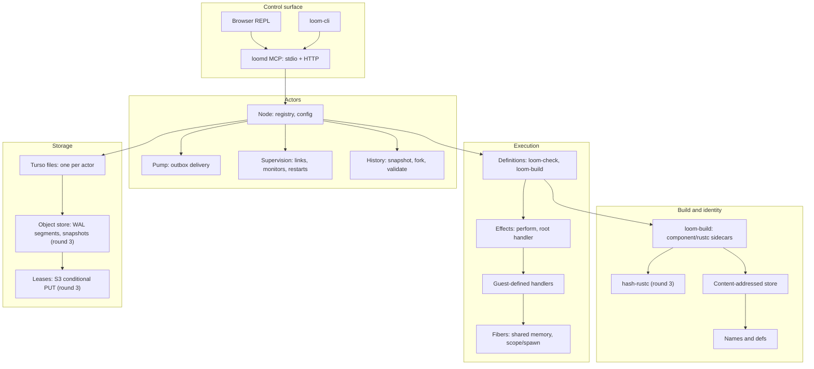

# Loom architecture

Read this first; every other doc in this repository is detail underneath it.

## 1. What Loom is

Loom is a Rust execution runtime: guest code is ordinary, unmodified Rust compiled to core WebAssembly, and effectful calls (`loom::sleep`, `loom::perform`, filesystem, model calls) suspend a WebAssembly fiber instead of requiring `async`/`.await`. Calling an effect performs it; algebraic effect handlers, which guests can define and the host installs as the outermost handler, give the meaning to that call. Definitions, component bytes, and effect results are content-addressed with BLAKE3, so a definition, a crate, and (in the actor model) a behavior are each a hash, not a path. Loom actors add durable state: one actor is a Loom behavior over one Turso (Rust SQLite) file, one inbox message runs as one transaction, and supervision follows OTP's vocabulary (links, monitors, restarts, strategies) so failures have a decided, testable meaning instead of an ad hoc one. One MCP server (`loomd`) and the browser REPL are the single control surface over definitions and actors; there is no second API with different guarantees.

## 2. Invariants

Each invariant names the code that enforces it today. "(round N)" marks a decision that is not yet built; the invariant still holds as an architectural commitment.

1. **One execution, one shared memory, one trust domain.** Guest code inside one execution (a call and its scoped/detached jobs) shares one WebAssembly linear memory; separate executions never share memory or guest pointers. Enforced in `crates/loom-rt/src/sharedcore.rs` (execution-owned `Store`/memory) and admission-checked by `crates/loom-check/src/safety.rs`.
2. **Calling an effect performs it; only the outermost handler is the host.** `loom.perform` dispatches through any installed guest handler stack before reaching the host dispatcher; recording and replay observe only that root. `crates/loom-rt/src/root_handler.rs`, ABI in `docs/shared-core-abi.md`.
3. **A handler is deep and its callback runs one frame out.** A handler stays installed for its body's dynamic extent; effects performed by the handler itself dispatch below its own frame, so a handler cannot recurse into itself. `crates/loom-guest-rs/src/handlers.rs`, host side `crates/loom-rt/src/sharedcore.rs`.
4. **Declared residual effects are enforced at the root, not by rustc.** `#[loom::def(effects = [...])]` is Loom's conservative source analysis and a runtime capability check; it is not a rustc effect type system. `crates/loom-check/src/rust_effects.rs`.
5. **One actor is one Turso file; the file is the entire state.** There is no separate checkpoint format for a running actor; `<dir>/<actor_id>.db` holds meta, inbox, domain tables, effects, outbox and code_changes. `crates/loom-actor/src/schema.rs`, `crates/loom-actor/src/actor.rs`.
6. **One inbox message is one transaction.** Domain writes, effect rows, outbox rows and the cursor advance commit together or not at all; nothing external happens except idempotently-keyed short effects. `crates/loom-actor/src/actor.rs::attempt`.
7. **Sends leave only after commit, through a keyed, per-pair-FIFO outbox.** A message is never observed by a receiver before its causing transaction is durable. `crates/loom-actor/src/pump.rs`.
8. **Delivery is exactly-once in effect via key dedupe, not via exactly-once transport.** `inbox.key` is `INSERT OR IGNORE`d; at-least-once redelivery of an already-applied key is a no-op. `crates/loom-actor/src/mailbox.rs`, `crates/loom-actor/src/ids.rs`.
9. **A trap is deterministic; a Turso I/O error is not.** Handler `Err`/panic rolls back and applies the actor's restart strategy; environmental errors retry with backoff before becoming a trap. `crates/loom-actor/src/node.rs::step`, `crates/loom-actor/src/actor.rs::attempt/poison`.
10. **Validating a candidate behavior never delivers the fork's outbox.** A fork's `status = fork` and the pump refuses to deliver from it; only `Matched`/`DivergedAt`/`Differs`/`Trapped` leave the fork. `crates/loom-actor/src/history.rs::validate_inner`, `crates/loom-actor/src/types.rs::Verdict`.
11. **Code identity is content, not a version number.** A behavior is addressed by hash in `code_changes`; a definition is addressed by its checked source hash. `crates/loom-actor/src/schema.rs` (`code_changes`), `crates/loom-check/src/lib.rs` (`CheckedDef`). Item-level, name-resolved behavior hashing (round 3, `tools/hash-rustc`, not yet in the tree) replaces today's whole-source hash for actor behaviors.
12. **One writer per Turso file is the concurrency unit.** Actors run concurrently with each other across files; one message runs at a time within one file, held behind one connection guarded by a mutex. `crates/loom-actor/src/node.rs` (`connections: HashMap<ActorId, Arc<Mutex<Connection>>>`).
13. **One control surface.** `loomd` serves MCP (stdio and HTTP) and the HTTP/WebSocket API from one `Service`; the REPL UI is a client of that same surface, not a second implementation. `crates/loom-mcp/src/lib.rs`, `crates/loom-api/src/lib.rs`. Actor-specific tools (`actor_send`, `actor_spawn`, `actor_tree`, ...) are decided but not yet wired (round 3/4; `loom-actor` has no `loom-mcp` caller today).
14. **Rust safety checks admit code; they do not prove isolation.** Denying `unsafe`, non-`Send` captures and escaping borrows is a correctness and admission check, not a formal soundness proof; sibling jobs sharing one execution's memory are one trust domain. `crates/loom-check/src/safety.rs`, stated in `docs/plan-unified-memory.md#memory-isolation-decision`.
15. **One guest language.** Rust is the only supported guest language, and core wasm is the only guest execution model. The former guest SDK, checker, interface definitions, and component execution paths have been removed. `crates/loom-proto/src/core_protocol.rs` admits only current core-wasm artifacts; `crates/loom-store/src/language.rs` rejects non-Rust stores before migration.

## 3. Layers



`loom-store` sits under both the definition path (CAS, names, the legacy event-fold actor tables) and, historically, actors; round 4 retires its `actors`/`inbox`/`log` tables once `loom-actor` is the only actor runtime, leaving `loom-store` as CAS plus definitions.

## 4. Life of a message

The decided end-state control surface routes an actor send through an `actor_send` MCP tool. That tool does not exist yet (round 3); today the equivalent call is `Node::send`, exercised directly in `crates/loom-actor/tests/integration.rs`. The transaction boundary and pump below the tool line are real and tested now.

```mermaid
sequenceDiagram
    participant Client as MCP client
    participant MCP as loomd (actor_send, round 3)
    participant Node as Node::send
    participant A as Sender actor file (A.db)
    participant Pump as Pump
    participant B as Receiver actor file (B.db)

    Client->>MCP: actor_send(target=A, msg)
    MCP->>Node: send(A, key, msg)
    Node->>A: INSERT OR IGNORE inbox (external key)
    Note over A: A's handler runs on the next step:<br/>one transaction = domain writes + effects rows + outbox rows + cursor
    A->>A: COMMIT
    Node->>Pump: deliver undelivered outbox rows for A
    Pump->>B: INSERT OR IGNORE inbox (key = "A:seq:idx")
    Pump->>A: mark outbox row delivered (own small transaction)
    Note over B: B only ever observes A's committed state;<br/>redelivery after a crash is a no-op via the inbox key
```

## 5. Life of a code change

```
node.promote(actor_id, behavior_hash, author, rationale)
  -> INSERT code_changes(seq, behavior_hash, parent_hash, author, rationale, schema_sql)
  -> run new behavior's schema() in the same transaction
  -> next message runs the new behavior; a parked actor resumes
```

Validating a candidate before promoting it:

```
node.validate(actor_id, candidate_hash, k)
  -> fork(actor_id, cursor - k)            # copy latest snapshot, replay inbox (snap_seq, cursor-k] with recorded effects
  -> promote candidate_hash on the fork
  -> replay inbox (cursor-k, cursor] on the fork, effects served from the original's `effects` table
  -> Matched{tables} | DivergedAt{seq, idx, expected, got} | Trapped{seq, error} | Differs{tables}
```

Lineage is `SELECT * FROM code_changes ORDER BY seq` on the actor's own file: it is a table, not a derived index, so it survives independently of any cache. The memoization key `(candidate hash, snapshot hash, inbox window hash, effects window hash)` that lets repeated validation skip replay, and the per-definition-lineage incremental compile cache keyed by the same item hashes, are decided but not implemented (round 3; today `validate_inner` always replays; see `crates/loom-actor/src/history.rs`).

## 6. Failure model

- **Trap vs runtime error.** A trap is a handler's returned `Err` or a caught panic: deterministic, attributed to guest code, and it drives supervision (`crates/loom-actor/src/actor.rs::attempt`, `Ctx::runtime`/`Ctx::effect_error` in `crates/loom-actor/src/lib.rs`). A runtime error (a Turso I/O failure, or an `EffectError::Environmental`) is environmental: the transaction rolls back and the message retries with backoff up to `Config.max_retries`, and only becomes a trap once that budget is exhausted (`crates/loom-actor/src/node.rs::step`).
- **Restart verbs.** `resume` (retry the poison message), `skip` (move it to `dead_letters`, advance the cursor), `reset` (archive the file, recreate it at the same id with the same code_changes head, replay the init message). Chosen by the supervisor per child spec's `restart: permanent | transient | temporary`. `crates/loom-actor/src/supervisor.rs`, `docs/actors-turso.md` Addendum A.
- **Strategies and intensity.** `one_for_one`, `one_for_all`, `rest_for_one`, and `dynamic` (simple-one-for-one); a supervisor tracks `max_restarts` in `max_seconds` and stops itself with reason `shutdown`, propagating up its own link, once exceeded. `crates/loom-actor/src/supervisor.rs`.
- **Machine loss, durability tiers (round 3).** Per-actor durability `local` (commit is local; WAL segments and snapshots ship to an object store roughly every second; losing the machine loses at most that unshipped tail) or `remote` (commit waits for the object store's acknowledgment; no tail to lose). Neither tier exists in the tree yet; today durability is whatever the local Turso WAL file gives you.
- **Stale-owner fencing (round 3).** A takeover writes a lease object keyed per actor with an epoch via S3 conditional PUT; a stale owner's segment-head write is rejected by the same conditional-PUT mechanism. Lease operations happen per takeover/renewal, never per message. Not yet implemented; there is currently no multi-machine takeover path for a `loom-actor` node.

## 7. Crate map

| Crate | Layer | Owner file |
|---|---|---|
| `loom-proto` | shared | `crates/loom-proto/src/lib.rs` — values, signatures, protocol, DAG-CBOR |
| `loom-check` | execution / identity | `crates/loom-check/src/lib.rs` — language checking, `CheckedDef`, effect-row analysis (`rust_effects.rs`), safety admission (`safety.rs`) |
| `loom-build` | build and identity | `crates/loom-build/src/lib.rs` — component/rustc build sidecars, build cache, crate registry (`registry.rs`) |
| `loom-guest-rs`, `loom-guest-macros` | execution | `crates/loom-guest-rs/src/lib.rs` — synchronous Rust guest API, `scope`/`spawn`, `handle`/`handle_any` |
| `loom-rt` | execution | `crates/loom-rt/src/lib.rs` — Wasmtime fibers, shared-memory executions (`sharedcore.rs`), root handler (`root_handler.rs`), machines (`machine.rs`) |
| `loom-store` | storage / identity | `crates/loom-store/src/lib.rs` — CAS, SQLite event history, definitions, names; still holds the legacy event-fold actor tables (round 4 removes them) |
| `loom-actor` | actors | `crates/loom-actor/src/lib.rs` — one Turso file per actor, `Behavior`, `Ctx`, supervision, history, validate |
| `loom-maintenance` | storage | `crates/loom-maintenance/src/lib.rs` — backups, bounded index and build-cache maintenance |
| `loom-process`, `loom-model` | execution support | `crates/loom-process/src/lib.rs`, `crates/loom-model/src/lib.rs` — supervised process execution, model provider boundary |
| `loom-api` | control surface | `crates/loom-api/src/lib.rs` — HTTP/WebSocket transport, auth (`auth.rs`), shared `Service` |
| `loom-mcp` | control surface | `crates/loom-mcp/src/lib.rs` — MCP tools (`loom_define`, `loom_eval`, `loom_command`, `crate_add`, `loom_upgrade`, `loom_resolve` today; actor tools round 3) |
| `loom-cli`, `loomd` | control surface | `crates/loom-cli/src/main.rs`, `crates/loomd/src/main.rs` — terminal client, server entrypoint |

## 8. What is deliberately not here

- **Priorities on messages.** One actor runs one message at a time, scheduled fairly by tokio; there is no per-message priority. Decided in `docs/actors-turso.md` Addendum B ("no priorities... deliberate").
- **ETS-style shared mutable tables.** No table is shared across actors; a table an OTP process would keep in ETS is instead its own actor, addressed by id. `docs/actors-turso.md` Addendum B.
- **Blocking receive mid-function.** A handler is one `receive`: the top of `handle`. There is no suspension across messages except through `cx.defer()` (selective receive) or a long effect; this is a CPS transform, not a missing feature. `docs/actors-turso.md` Addendum B.
- **Distribution.** Ids reserve a cell-prefix byte for a future multi-node namespace, but cross-node delivery, `monitor_node`, and any wire protocol between Loom nodes are out of scope for this round. `docs/actors-turso.md` ("later" row, ids reserved as `"a0"` prefix).
- **Capabilities today.** Every actor in a node can address every other by id; host-minted capability tokens (`{target, cap_id, epoch, rights, hmac}`) are a later round, not a v1 concept. `docs/actors-turso.md` ("What is deliberately not in v1").
- **Raft or any consensus protocol.** Availability without a single point of failure comes from WAL-segment shipping to an object store plus lease fencing (round 3, §6), never from a replicated consensus log.

## 9. Roadmap

- **Round 1 (landed, `58bee73`).** Shared execution (core wasm, fibers, safe-code admission), guest-defined algebraic effect handlers, content-addressed handler linking. Done-when: `bun scripts/bench/effects-handlers.ts` at 13/13, `bun scripts/bench/shared-execution.ts` at 7/7.
- **Round 2.** MCP surface consolidation, README rewrite (Rust-first, under 200 lines), repository rename follow-through. Done-when: README is the single onboarding doc under 200 lines and the four current MCP tools are its documented entrypoint.
- **Round 3 (this doc's "in progress" items).** `hash-rustc` item-level behavior hashing, `code_changes.behavior_hash`/`wasm_hash`/`toolchain_hash`, memoized validation, clippy-clean workspace, always-up durability (object store, leases). Guest-language and interface removal is complete: Rust guests execute only as core wasm. Remaining done-when: `tools/hash-rustc` exists and is the source of `code_changes.behavior_hash`; `cargo clippy --workspace` is clean; a `local`/`remote` durability tier exists and is tested against machine loss.
- **Round 4.** Retire the event-fold actor model in `loom-store` (`actors`, `inbox`, `log` tables) now that `loom-actor` is the only actor runtime; wire `loom-actor` into `loomd`/`loom-mcp` with the full actor tool surface (`actor_list`/`tree`/`info`/`send`/`spawn`/`stop`/`restart`/`promote`/`promote_where`/`lineage`/`dead_letters`/`fork`/`validate`/`sql`/`whereis`/`register`/`members`/`behaviors`/`run` and the `actor://` resources). Done-when: `crates/loom-store/src/schema.sql` has no `actors`/`inbox`/`log` tables, and the REPL UI drives actors over the MCP actor tools.

## 10. Glossary

- **Actor.** One Turso file, one behavior, one inbox; the unit of durable state and supervision.
- **Definition.** A checked, content-addressed piece of guest code (a callable, an actor behavior source, or a stored handler); identity is a hash of its checked source.
- **Behavior.** The Rust implementation of `loom_actor::Behavior` that an actor runs; addressed by content hash and recorded per-actor in `code_changes`.
- **Effect.** A named, typed request from guest code to a handler (`sleep`, `fs.read`, `now`, ...), dispatched through `loom.perform`.
- **Handler.** Guest- or host-supplied code that gives an effect its meaning; a deep handler stays installed for its body's dynamic extent; the host is the outermost handler.
- **Fiber.** The suspended, resumable execution of a guest call, implemented over Wasmtime; what lets an effect suspend without `async`/`.await` in guest source.
- **Pump.** The node component that reads an actor's committed, undelivered outbox rows and delivers them (to another actor's inbox, to a spawn target, or to an effect handler), each delivery independently keyed and idempotent.
- **Outbox.** The append-only, per-transaction table of sends/spawns/long-effect requests an actor produced; nothing in it is visible to anyone until its transaction commits.
- **Lease.** (round 3) A per-actor object in the object store, written with a conditional PUT and an epoch, that fences which machine may own and advance an actor.
- **Segment.** (round 3) A shipped range of Turso WAL frames in the object store, the unit that lets any historical sequence be reached without full replay.
- **Snapshot.** A full copy of an actor's file at a given sequence (`VACUUM INTO` or Turso's equivalent), used as the base for fork and for bounding replay length.
- **Verdict.** The result of validating a candidate behavior against recorded history: `Matched`, `DivergedAt`, `Trapped`, or `Differs`.
